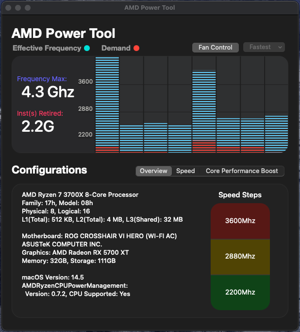

# ryzentosh-x370-14.5

EFI folder for a Ryzentosh with a x370 motherboard

<p></p>
<p align="center"> EFI</p>
<p align="center">
 <a href="https://www.apple.com/macos">
  
 </a>
 <a href="https://github.com/acidanthera/OpenCorePkg">
  
 </a>
 <a href="https://github.com/haxgun/Ryzentosh/blob/main/LICENSE">
  
 </a>
</p>

<h2></h2>

> **Warning**
>
> Use at your own risk. I built this EFI for myself and it does not guarantee 100% work with your hardware.
>
> Serial Number, SystemUUID sections are specifically left empty. Use GenSMBIOS to generate SMBios.

<h2 align="center">📺 Build</h2>

| **Component** | **Model**                      |
| ------------- | ------------------------------ |
| CPU           | AMD Ryzen 7 3700X @ 3.6GHz     |
| Motherboard   | Crosshair Hero VI (Wi-fi)      |
| GPU           | ASUS AMD Radeon RX 5700XT      |
| RAM           | Corsair LPX 4 x 8GB @ 3200 MHz |
| macOS         | Sonoma 14.5                    |
| OpenCore      | 1.0.0 Release                  |

</details>

**⚠️ You can read more about the BIOS settings in [the guide](https://dortania.github.io/OpenCore-Install-Guide/AMD/zen.html#amd-bios-settings)**

<h2 align="center">🩼 Functional</h2>

-   [x] macOS thanks to [dortania](https://dortania.github.io/OpenCore-Install-Guide/)
-   [x] CPU by [AMD-Vanilla](https://github.com/AMD-OSX/AMD_Vanilla)
-   [x] Audio by [AppleALC](https://github.com/acidanthera/AppleALC)
-   [x] dGPU by [WhateverGreen](https://github.com/Acidanthera/WhateverGreen)
-   [x] Ethernet
-   [x] iServices & DRM
-   [x] Sleep
-   [x] Bluetooth
-   [ ] Airdrop / Handoff (no wifi)

<h2 align="center">💽 Kexts used</h2>

-   [x] AMDRyzenCPUPowerManagement.kext
-   [x] AppleALC.kext
-   [x] AppleIGB.text
-   [x] AppleMCEReporterDisabler.kext
-   [x] BlueToolFixup.kext
-   [x] Lilu.kext
-   [x] NVMeFix.kext
-   [x] RestrictEvents.kext
-   [x] SmallTreeintel82576.kext
-   [x] SMCAMDProcessor.kext
-   [x] SMCRadeonSensors.kext
-   [x] USBToolBox.kext
-   [x] UTBMap.kext
-   [x] VirtualSMC.kext
-   [x] WhateverGreen.kext

</details>

<h2 align="center">🪚 Change it for youself</h2>

Edit the core count patch to match your CPU

See [AMD Vanilla OpenCore](https://github.com/AMD-OSX/AMD_Vanilla/tree/master) or [OpenCore-Install-Guide](https://dortania.github.io/OpenCore-Install-Guide/extras/ventura.html#amd-patches)

<details>
    <summary>Mini-Guide</summary>
    Find the three `algrey - Force cpuid_cores_per_package`

    - `kernel -> Patch -> 0  -> Replace` for macOS 10.13.x, 10.14.x
    - `kernel -> Patch -> 1  -> Replace` for macOS 10.15.x, 11.x
    - `kernel -> Patch -> 2  -> Replace` for macOS 12.x, 13.0 to 13.2.1
    - `kernel -> Patch -> 3  -> Replace` for macOS 13.3

    ```
    B8000000 0000 => B8 <core count> 0000 0000
    BA000000 0000 => BA <core count> 0000 0000
    BA000000 0090 => BA <core count> 0000 0090
    BA000000 00 => BA <core count> 0000 00
    ```

    | CoreCount | Hexadecimal |
    | --------- | ----------- |
    | 6 Core    | 06          |
    | 8 Core    | 08          |
    | 12 Core   | 0C          |
    | 16 Core   | 10          |
    | 32 Core   | 20          |
    | 64 Core   | 40          |

    For example 5600G has 6 cores

    ```
    B8 06 00000000
    BA 06 00000000
    BA 06 00000090
    BA 06 000000
    ```

</details>

<h2 align="center">🔧 Tools</h2>

1. [Hackintool](https://github.com/benbaker76/Hackintool)
2. [OpenCore Configurator](https://mackie100projects.altervista.org/download-opencore-configurator/)
3. [CPU Name](https://github.com/corpnewt/CPU-Name)

<h2 align="center">🧱 Scripts</h2>

> **Warning**
>
> All scripts must be used with elevated rights! To do this, use
> `sudo bash <name_script>.sh`

1. **hostname.sh** - change the name of your computer's name or local hostname on Mac
2. **clear-network-interfaces.sh** - helps to solve problems with en0 ethernet

<h2 align="center">💡 Tips</h2>

1.  If you want to change the processor name, use [this](https://github.com/corpnewt/CPU-Name)
2.  If you have a 1-in-1 CPU and motherboard configuration like mine, you can use this config. If it is different, I advise you to assemble it yourself according to [the guide](https://dortania.github.io/OpenCore-Install-Guide/). This way you will spend less time solving problems and everything will work fine. 🫡

<h2 align="center">🏞️ Screenshot</h2>
<div align="center">


<br/>


</div>
